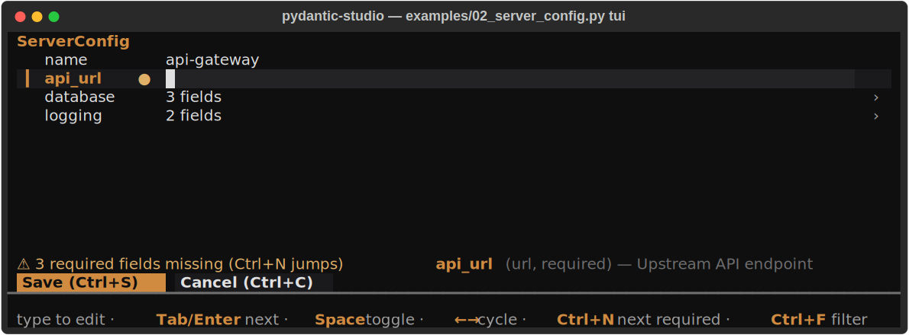
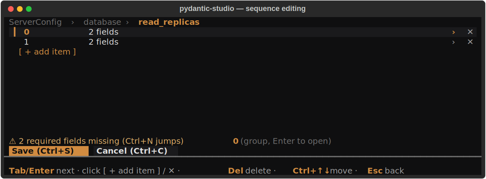
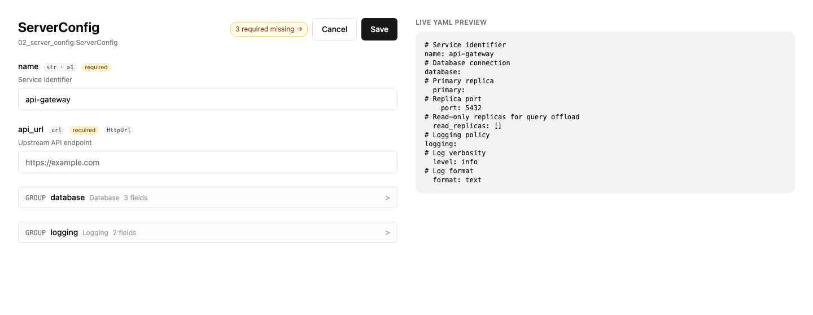
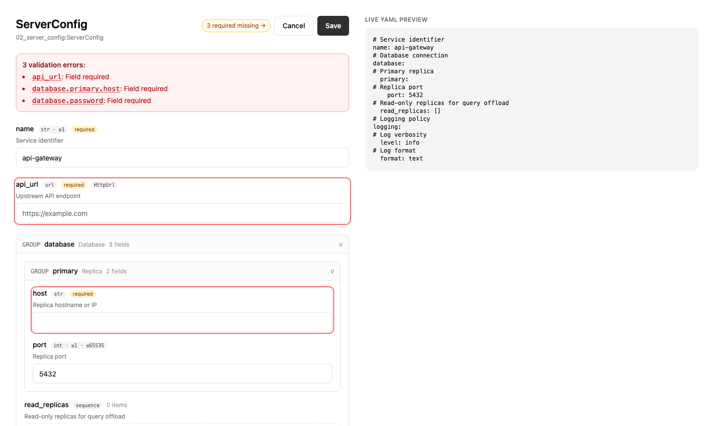

# pydantic-studio

**Interactive editor for Pydantic models.** Generate and edit `config.yaml` /
`config.toml` / `config.json` against a strongly-typed schema, with three
frontends sharing a single form-state model: sequential console prompts, a
Textual TUI, and a React-backed local web app.

[](#status)
[](#install)
[](#development)

---

## At a glance

**Console prompt flow** (default) — a Yeoman-style wizard for plain
terminals, SSH sessions, and quick config generation. It asks one
question at a time, shows the current/default value in brackets, keeps
the value when you press Enter, and re-prompts invalid answers:

```text
$ pydantic-studio edit myapp.config:AppSettings config.yaml
Editing AppSettings
name [prod]: staging
port [8080]: 9090
debug [false]: y
level (debug/info/warn) [info]: warn
saved to config.yaml
```

**Textual TUI** — a real form, not a modal editor: the focused field IS
the editable field (type to edit, `Tab`/`Enter` to flow on), with inline
descriptions and constraints, a required-field counter that `Ctrl+N`
jumps through, and clickable Save/Cancel:

<p align="center">
  
</p>

Containers are first-class: breadcrumb drill-in, a clickable
`[ + add item ]` row, per-row `✕` delete, `Ctrl+↑↓` reorder:

<p align="center">
  
</p>

**Browser UI** (`--frontend web`) — the same session contract in a local
web form: live YAML preview with your comments, nested models collapsed
to one-line summaries, a required-missing counter in the header:

<p align="center">
  
</p>

Validation errors anchor to their fields — the banner entries are
click-to-jump links, offending rows ring red, and collapsed sections
holding an error expand themselves:

<p align="center">
  
</p>

Every shot above is generated from the shipped example
(`uv run python scripts/readme_screenshots.py`, driving
`examples/02_server_config.py`) — run it yourself to reproduce.

---

## Why?

Hand-editing config files is error-prone. Pydantic schemas already encode
the contract — types, constraints, defaults, descriptions. pydantic-studio
turns that schema into an editor, with format round-trip that preserves
your hand-written comments.

## Status

**v0.4.0 — Alpha.** All 9 implementation phases plus the task-oriented
TUI overhaul are merged on master. Production code paths are exercised
by 1254 tests: 1212 default unit/integration/TUI/web smoke tests plus 42
explicit Playwright browser e2e tests. The editing session now has an
explicit submit/cancel contract (`run_app` returns `EditOutcome`), and
loading is symmetric with saving (existing values run through field validators — see
`docs/superpowers/specs/2026-06-11-task-oriented-editing-design.md`).
CI runs the default suite on Python 3.11, 3.12, 3.13, and 3.14; the
browser, frontend bundle, wheel and sdist install smoke gates, and
metadata checks for both wheel and sdist run on Python 3.13.
Tag-triggered PyPI publishing uses GitHub OIDC Trusted Publishing with
the `pypi` environment, not a repository API-token secret. The same
release artifact is also published to piesource with independent
failure handling and a final aggregate result; see `docs/site/release.md`
for the required publisher setup. Version changes are recorded in
`CHANGELOG.md`; vulnerability reporting guidance is in `SECURITY.md`;
contributor setup and validation guidance is in `CONTRIBUTING.md`.

## Install

```bash
pip install pydantic-studio
# or
uv add pydantic-studio
```

For `EmailStr` support, install with the `email` extra:

```bash
pip install 'pydantic-studio[email]'
```

## Quick start

### Programmatic

```python
from pydantic import BaseModel, Field, HttpUrl, SecretStr
from pydantic_studio import build_form_tree, save_yaml


class AppSettings(BaseModel):
    name: str = Field(default="prod", description="Service identifier")
    port: int = Field(default=8080, ge=1, le=65535, description="Listening port")
    api_url: HttpUrl = Field(default=HttpUrl("https://api.example.com"))
    api_key: SecretStr = Field(default=SecretStr("change-me"))


tree = build_form_tree(AppSettings)
tree.set_value("port", 9090)
save_yaml(tree, "config.yaml")
```

```yaml
# Service identifier
name: prod
# Listening port
port: 9090
api_url: https://api.example.com
api_key: change-me
```

### CLI

```bash
# Stub a fresh config from defaults
pydantic-studio fill myapp.config:AppSettings --out config.yaml

# Validate without launching anything
pydantic-studio check myapp.config:AppSettings config.yaml

# Print the validated model
pydantic-studio run myapp.config:AppSettings config.yaml

# Ask one console prompt per field, then save
pydantic-studio edit myapp.config:AppSettings config.yaml

# Omit the file to start from defaults and save to AppSettings.yaml
pydantic-studio edit myapp.config:AppSettings

# Or open the Textual TUI
pydantic-studio edit --frontend tui myapp.config:AppSettings config.yaml

# Or the React-backed browser UI
pydantic-studio edit --frontend web myapp.config:AppSettings config.yaml
```

Format is auto-detected from extension (`.yaml` / `.yml` / `.toml` / `.json`).

### Console Mode

`edit` defaults to the console renderer. It is intentionally not a
full-screen UI: it behaves like a Yeoman-style prompt wizard, asking one
question at a time in the current terminal.

Each prompt includes the field path and current/default value. Press
Enter to keep that value, or type a replacement. Choice fields show the
allowed labels inline (`level (debug/info/warn) [info]:`), booleans
accept common yes/no forms, and invalid input is rejected without
mutating the tree:

```text
port [8080]: abc
cannot parse 'abc' as int
port [8080]: 9090
```

Containers stay sequential as well: lists and mappings first ask for a
count, then prompt through each item or entry. When all prompts are
complete, the tree is validated through the normal save path and written
to the configured target; `run_console_app(...)` returns
`EditOutcome("submitted")` on that successful completion.

### Textual TUI

The TUI is a **form**: the focused field is the editable field — type
to edit (focus selects the text, like Tab in a browser), no edit mode
to enter or leave. Mouse is on by default (click rows, toggles, the
Save/Cancel buttons; wheel scrolls).

| Key | Action |
|---|---|
| type | Edit the focused field (persistent input, masked for secrets) |
| `Tab` / `Shift+Tab` / `↑` `↓` | Commit the pending value, move to the next/previous field (invalid values block the move and show why) |
| `Enter` | Commit + advance; on containers: open; on large enums: chooser |
| `Space` / `←` `→` | Toggle bools / cycle choices and union variants |
| `Ctrl+S` | Submit: flush + validate, write `save_path` if configured, exit `submitted`. On failure the cursor jumps to the first offending field |
| `Ctrl+C` | Cancel: clean tree exits `cancelled`; dirty tree asks (`S` save & exit / `D` discard / `Esc` keep editing) |
| `Ctrl+N` | Jump to the next missing-required field |
| `Ctrl+F` | Filter fields by name substring (group screens) |
| `Esc` | Layered: revert field → clear filter → pop child screen → cancel session |
| `F2` / `Del` / `[ + add item ]` / `✕` | Rename mapping key / delete / add items on container screens |
| `Ctrl+Z` / `Ctrl+Y` | Undo / redo |

`run_app(tree, save_path=None, readonly_paths=())` returns an
`EditOutcome`; persist the tree only when `outcome.submitted` is true.
A one-line HelpBar describes the focused field (type, constraints,
required-ness, `FieldInfo.description`) and counts missing required
fields. `readonly_paths` marks caller-owned fields: the row is labeled
`(read-only)` and edits are rejected with a visible message. Indexed
children may use either dotted or bracket syntax (`tags.0` and
`tags[0]` are equivalent).

### Browser UI

`--frontend web` boots a local FastAPI app on a random free port and
opens your browser (a React form sharing the TUI's session contract:
`run_html_app(...) -> EditOutcome`, `readonly_paths` supported).
Submit errors anchor to their fields (click-to-jump, red ring,
auto-scroll); nested models collapse to one-line summaries (untouched
optional models say `not set`); the header counts and cycles missing
required fields; the YAML preview updates live. Closing the tab
triggers a 30-second heartbeat timeout (configurable via
`run_html_app(..., heartbeat_timeout_seconds=...)`) and the server
shuts down with a `cancelled` outcome.

### Embedding

The Web renderer is ASGI-first and can be mounted into a larger host app:

```python
from fastapi import FastAPI
from pydantic_studio import build_form_tree, mount_html_app

app = FastAPI()
server = mount_html_app(app, "/studio", tree=build_form_tree(AppSettings))
```

Use `StudioScreen(EditSession(...))` when embedding inside an existing Textual
app; use `StudioApp` / `run_app` when pydantic-studio owns the terminal session.

## Type coverage

| Family | Types |
|---|---|
| Primitives | `str`, `int`, `float`, `bool`, `Decimal` |
| Choices | `Enum`, `Literal[...]` |
| Containers | `list[T]`, `set[T]`, `tuple[T, ...]`, `tuple[T1, T2, ...]`, `dict[K, V]` |
| Unions | `T \| U`, `Optional[T]` |
| Temporal | `datetime`, `date`, `time`, `timedelta` |
| Network | `IPv4Address`, `IPv6Address`, `IPv4Network`, `IPv6Network`, `AnyUrl`/`HttpUrl`/`FileUrl`, `EmailStr` |
| Special | `pathlib.Path`, `uuid.UUID`, `SecretStr`, `SecretBytes`, `re.Pattern`, `bytes` |
| Constraints | Pydantic v2 `Annotated` constraints (`ge`/`le`/`min_length`/`pattern`/etc.) — auto-wired |

Add custom types via `register_builder(MyBuilder())`.

## File-format support

| Format | Read | Write | User-comment round-trip |
|---|---|---|---|
| YAML | `ruamel.yaml` | `ruamel.yaml` | ✓ |
| TOML | `tomllib` (stdlib) | `tomlkit` | description comments only |
| JSON | stdlib `json` | `model_dump_json(indent=2)` | n/a (JSON has no comments) |

```python
from pydantic_studio import load_config, save_config

tree = load_config("config.toml", AppSettings)   # picks parser by extension
tree.set_value("port", 9090)
save_config(tree, "config.toml")                 # picks writer by extension
```

Format-specific helpers — `load_yaml` / `save_yaml`, `load_toml` /
`save_toml`, `load_json` / `save_json`, `save_draft_yaml` (skips
validation for mid-edit drafts) — are also exported.

## Public API surface

```python
from pydantic_studio import (
    # Tree construction
    build_form_tree, FormTree, FormNode,
    # Root model variants
    VariantSpec, VariantRegistry, build_variant_form_tree,
    # 24 node types
    StringNode, IntNode, FloatNode, BoolNode, DecimalNode,
    DatetimeNode, DateNode, TimeNode, TimedeltaNode,
    IpAddressNode, IpNetworkNode, UrlNode, EmailNode,
    PathNode, UuidNode, SecretNode, PatternNode, BytesNode,
    EnumNode, LiteralNode, SequenceNode, MappingNode, UnionNode, GroupNode,
    # I/O
    load_config, save_config,
    load_yaml, save_yaml, save_draft_yaml,
    load_toml, save_toml,
    load_json, save_json,
    # Drafts
    save_draft, load_draft, delete_draft, find_draft, draft_newer_than,
    # Renderers
    run_console_app,              # sequential console prompts -> EditOutcome
    EditSession, SubmitResult,    # shared renderer session lifecycle
    StudioApp, StudioScreen, run_app,  # Textual TUI
    EditOutcome,                  # session result: submitted | cancelled
    StudioServer, mount_html_app, run_html_app,  # HTML / React SPA / ASGI
    # Registry
    Registry, NodeBuilder, register_builder,
    default_registry, reset_default_registry,
    # Validation + exceptions
    ValidationResult,
    PydanticStudioError, NoBuilderError,
    CancelledByUser, ValidationFailedError,
)
```

## Root model variants

When one editor entry point can produce several Pydantic model classes,
keep that selection in pydantic-studio instead of coupling your app to a
project-specific config factory:

```python
from pydantic import BaseModel
from pydantic_studio import VariantRegistry, VariantSpec, build_variant_form_tree


class EmailNotifier(BaseModel):
    address: str = "ops@example.com"


class SlackNotifier(BaseModel):
    channel: str = "#ops"


variants = VariantRegistry(
    [
        VariantSpec(id="email", model=EmailNotifier, label="Email"),
        VariantSpec(id="slack", model=SlackNotifier, label="Slack"),
    ]
)

tree = build_variant_form_tree(
    variants,
    selected_id="email",
    discriminator="class_name",
    persistence="inline_discriminator",
)
```

The selection is renderer-native: console asks `variant (email/slack)
[email]:`, TUI shows a root `Variant` row that cycles with `←`/`→`,
and the web UI renders a selector in the page. The default persistence
mode is `metadata`, which keeps the choice in the session only. Use
`inline_discriminator` to write a discriminator key such as
`class_name: slack` alongside the selected model fields.

## Drafts (auto-save + recovery)

```python
from pydantic_studio import find_draft, load_draft, save_draft, delete_draft

# Mid-session
save_draft(tree, ".pydantic-studio.draft.json")

# On the next launch
existing = find_draft(".")
if existing is not None:
    tree = load_draft(existing, MyConfig)
    # ... user resumes editing ...
    delete_draft(existing)  # on successful submit
```

`save_draft_yaml(tree, path)` is the YAML equivalent — it skips
`to_instance()` validation so partial trees can persist mid-edit.

## Architecture

```
Frontends
  console prompts    Textual TUI      HTML browser      CLI helpers
  run_console_app    StudioApp        StudioServer      fill/run/check
        \                |                /                  |
         \               |               /                   |
          v              v              v                    v
FormTree (canonical state)
  - 24 node types, discriminated by `kind`
  - path-addressed mutations: set_value / add_item / rename_key / ...
  - snapshot ring for undo / redo
  - validate-first contract
        |
        v
I/O layer
  - load_config / save_config (extension dispatch)
  - YAML / TOML / JSON helpers
  - draft persistence
```

The full architecture doc is at `docs/site/architecture.md`. Run
`uv run mkdocs serve` to read it locally.

## Development

```bash
git clone https://github.com/invoker-bot/pydantic-studio
cd pydantic-studio
uv sync

# Tests
uv run pytest -q                          # 1212 default tests; skips tests/e2e/
uv run pytest tests/unit/test_yaml_io.py  # focused

# Lint
uv run ruff check
uv run pyright src/pydantic_studio       # production code only

# Docs
uv run mkdocs serve                       # 127.0.0.1:8000
uv run mkdocs build --strict              # also covered by test_docs_build.py

# Packaging
uv build
uv run twine check dist/*
uv run python -m venv .dist-smoke-wheel
.dist-smoke-wheel/bin/python -m pip install dist/*.whl
.dist-smoke-wheel/bin/pydantic-studio version
uv run python -m venv .dist-smoke-sdist
.dist-smoke-sdist/bin/python -m pip install dist/*.tar.gz
.dist-smoke-sdist/bin/pydantic-studio version
```

GitHub Actions mirrors this split: the default suite runs across Python
3.11-3.14, while browser and packaging gates run once on Python 3.13.

Project conventions are documented in [`CLAUDE.md`](CLAUDE.md) — the
guide for AI-assisted development sessions, but useful for any
contributor.

## Frontend development (Phase 2+)

The console and Textual frontends are pure Python. For example:

```bash
uv sync
uv run python examples/05_console_prompts.py
uv run python examples/02_server_config.py tui
```

The web renderer is a React SPA built with Vite, source under `frontend/`. End users do NOT need Node — `pip install pydantic-studio` ships the pre-built bundle. To modify the SPA:

```bash
cd frontend
corepack enable && corepack prepare pnpm@9 --activate   # one-time
pnpm install
pnpm dev              # Vite dev server with HMR; proxies /api/* to FastAPI on :8000

# in another terminal - dev-backend pins port 8000 to match Vite's proxy.
# (The packaged `examples/*.py web` flow binds an ephemeral port; great
# for end users, useless for a fixed-port dev proxy.)
uv run python frontend/scripts/dev-backend.py

# then open http://localhost:5173 (Vite's port; the proxy forwards
# /api/* to FastAPI on :8000).

# To refresh the committed bundle:
pnpm build            # or frontend/scripts/build.sh
git add ../src/pydantic_studio/renderers/html/static/dist
```

The bundled output (`src/pydantic_studio/renderers/html/static/dist/`) is committed to the repo so CI and downstream users don't need a Node toolchain.

### Running the Playwright e2e suite (Phase 3+)

The unit-test default skips `tests/e2e/` and disables the `pytest-playwright` plugin (its mere presence interferes with Textual's `App.run_test()` under `asyncio_mode="auto"`). To run the e2e suite explicitly:

```bash
uv run playwright install chromium                                  # one-time, ~150 MB
uv run python -m pytest tests/e2e -p playwright -o "addopts=-ra"    # 42 browser tests
```

## License

MIT.
